##### These procedure steps will be followed on the simulator

1. Open the Aggregates Crushing Value experiment a window will open with objectives and apparatus used, click on descrption to understand the terminologies in the experiment, click on NEXT button to proceed. 
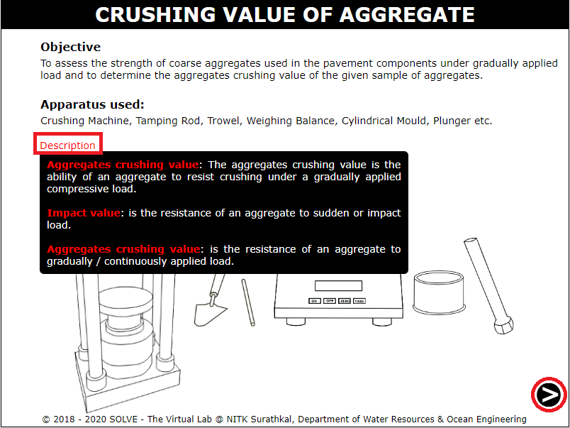 

2. Click on ON button to switch on the weighing balance. 
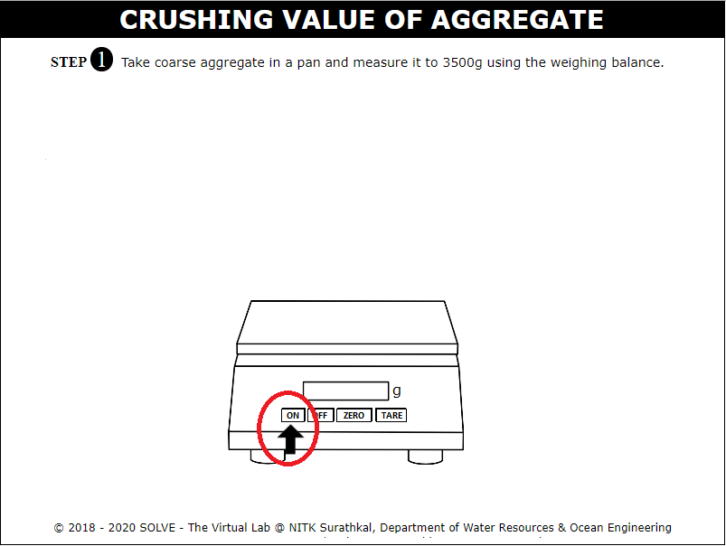 

3. Click on the tray containing coarse aggregate to measure 3500 gram of it. 
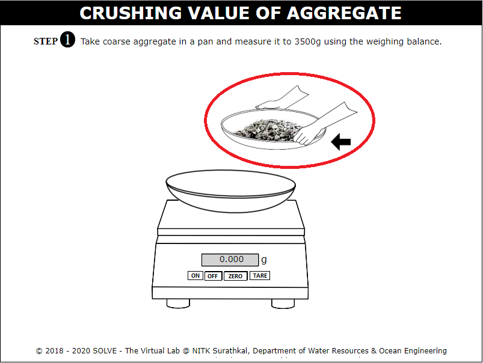 

4. Measure 3500 gram of coarse aggregate, click on NEXT button to proceed. 
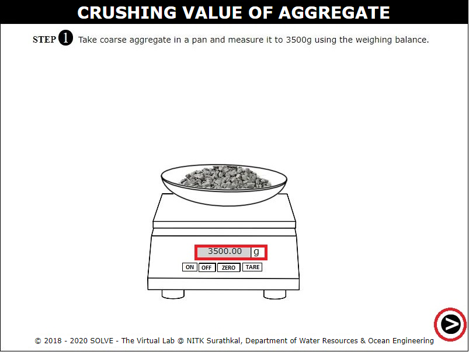 

5. Click on the set of sieves to arrane it according to ascending order, transfer the weighed quantity of coarse aggregates to the set of seives. 
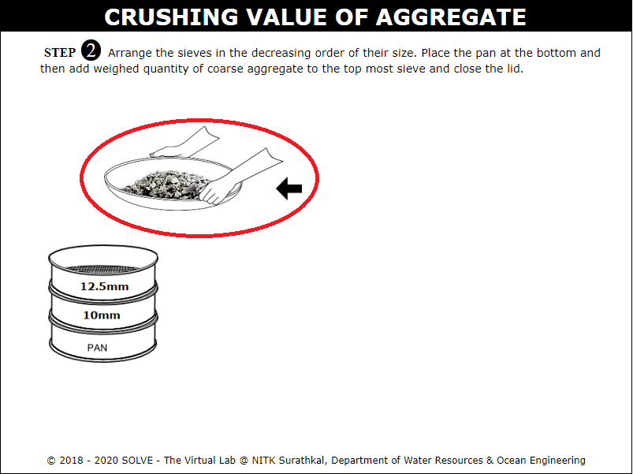 

6. Click on the set of sieves to place it in the mechanical shaker, click on ON button to on the mechanical shaker, click on NEXT button to proceed. 
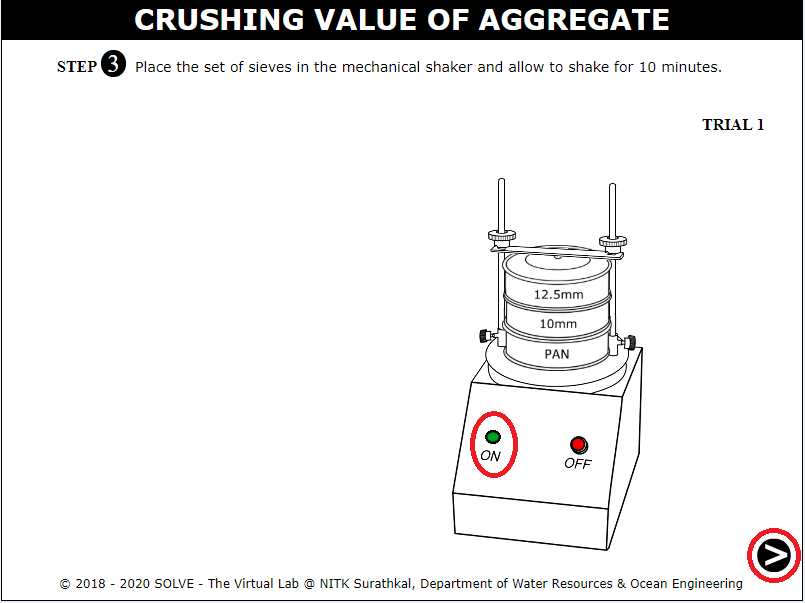 

7. Click on 10mm sieve to collect the sample retained on it. 
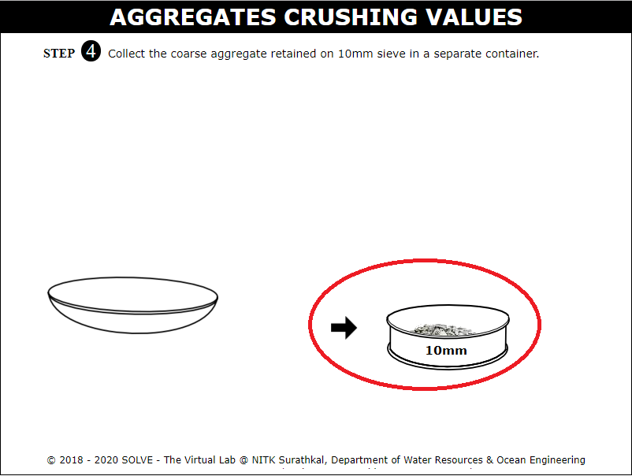 

8. Click on the cylinder to obtain empty weight W1(g) of cylinder. 
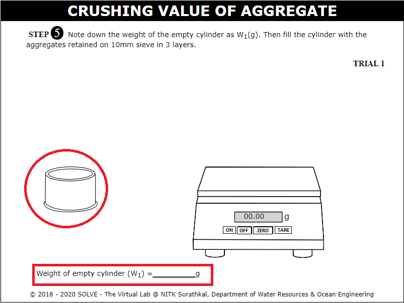 

9. Select correct answer to the question inorder to proceed with the simulation. 
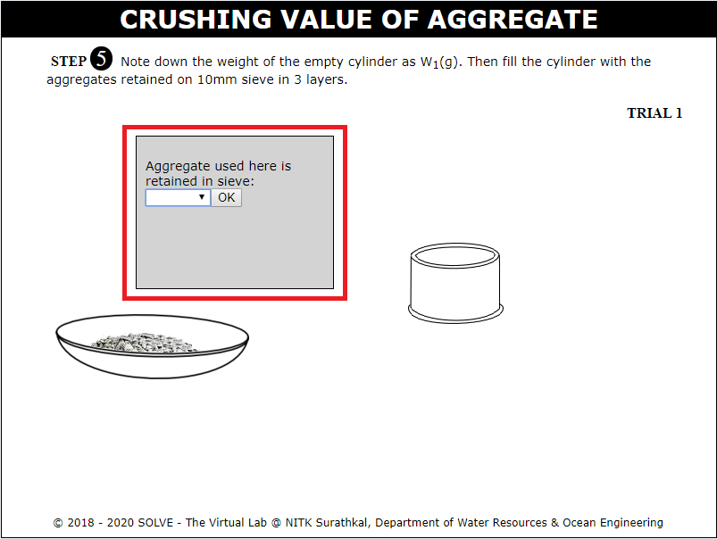 

10. Click on the trowel to add the agregates in three layers to the cylinder. 
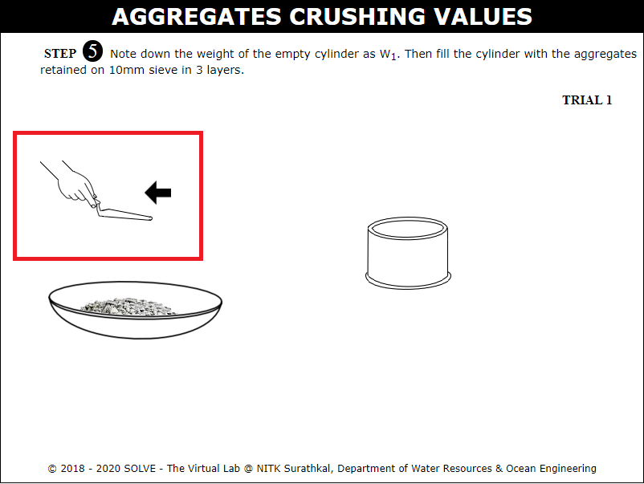 

11. Go through the instrution given, click on OK to proceed. 
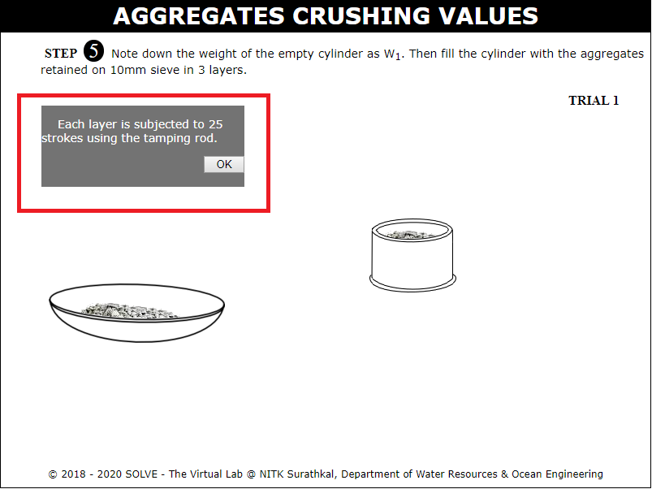 

12. Click on tamping rod to tamp each layer of aggregates for 25 times. 
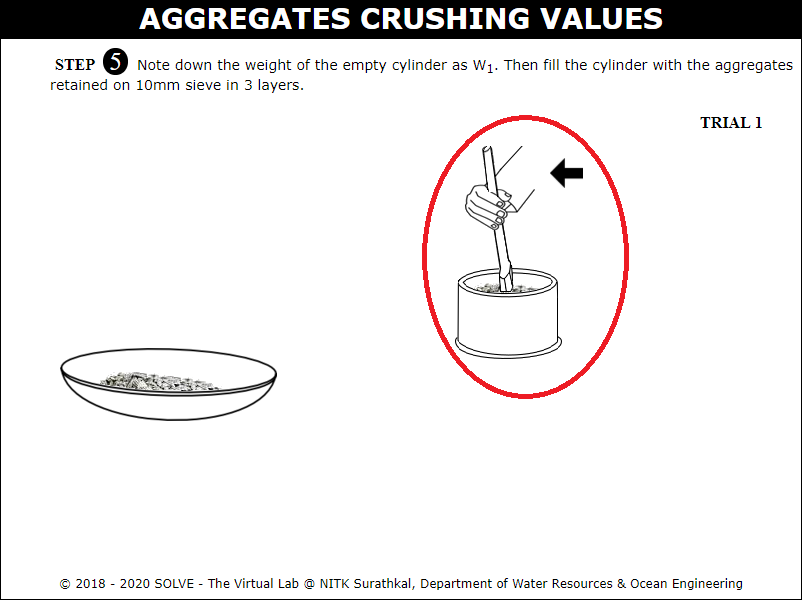 

13. Click on the cylinder to obtain weight W2(g) of cylinder with aggregate. 
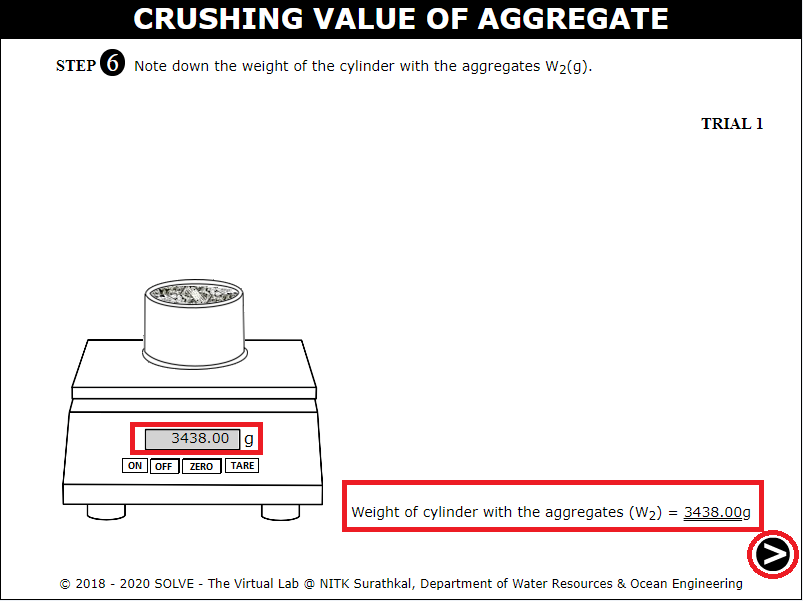 

14. Cylinder is placed in position on base plate and plunger is placed so that it rests on level surface. 
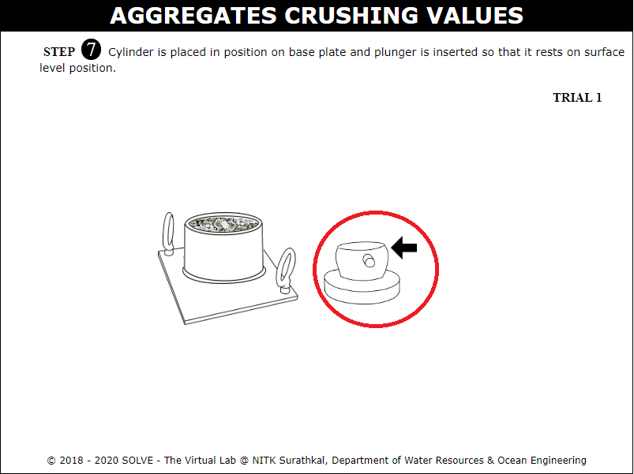 

15. Place the cylinder in position along with the plunger in the compression testing machine, ON the machine and apply 40 tonnes of load then OFF the machine and release the load, click on NEXT button. 
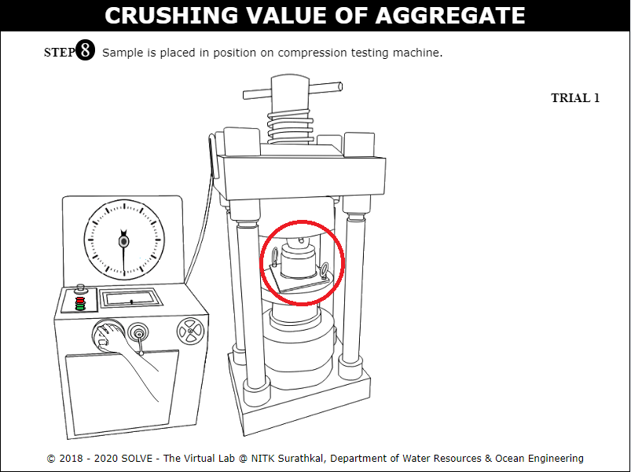 

16. Click on the cylinder to transfer the aggregate into 2.36mm sieve. 
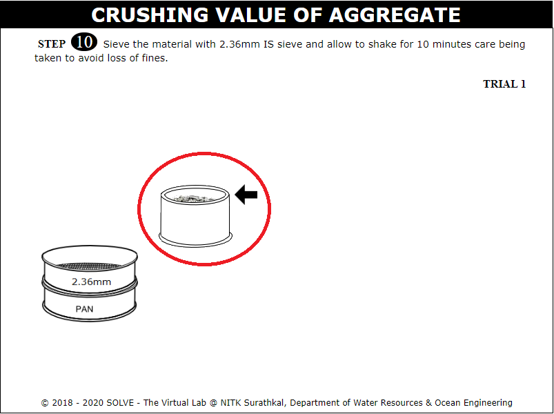 

17. Once the aggregate is added into sieves click on the set of sieves to place it in the mechanial shaker. 
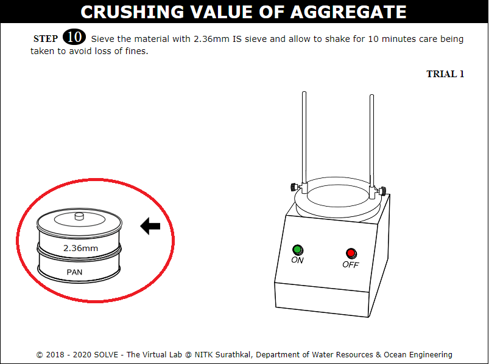 

18. Calculate the weight of aggregate retained on pan, click on NEXT button to proceed. 
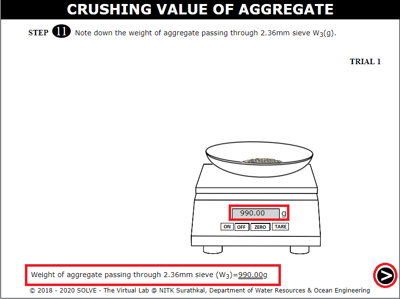 

19. Calculate the average aggregate crushing value, click on CHECK button to evaluate the answer. 
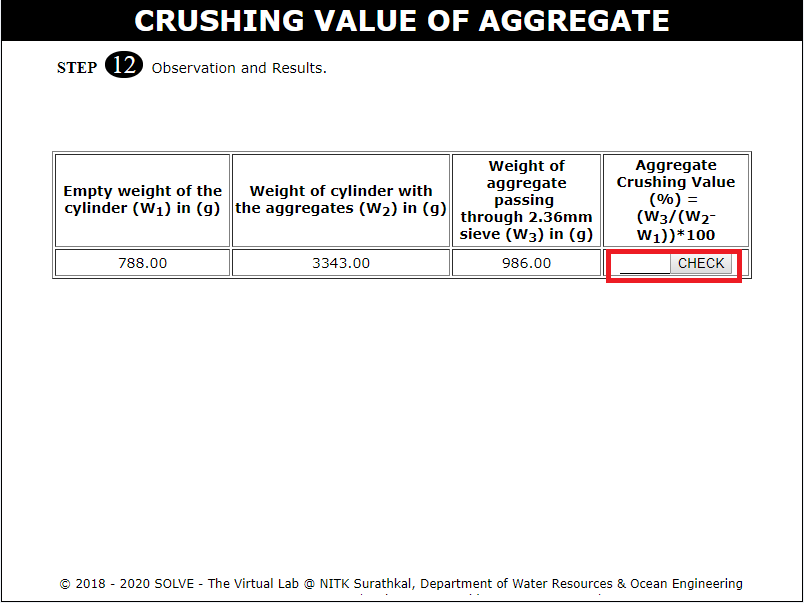 

20. Obtain the Result and Inference. 
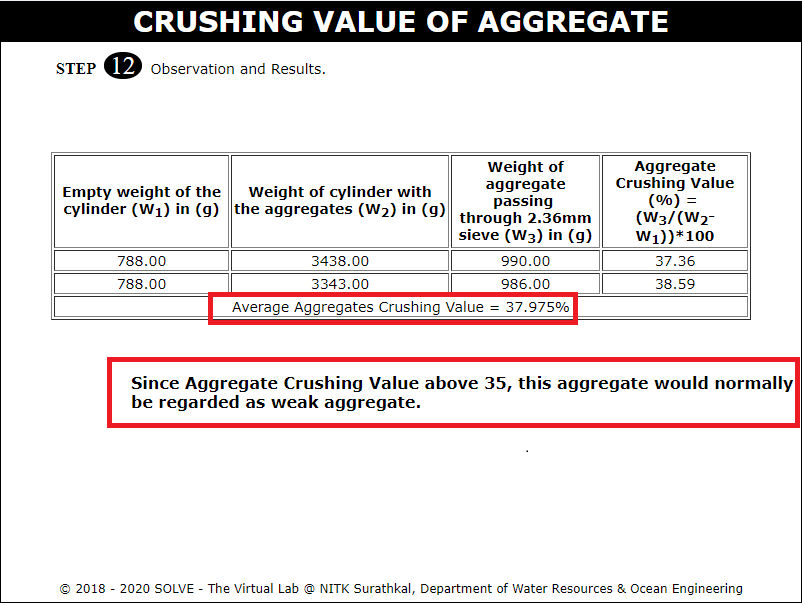 
