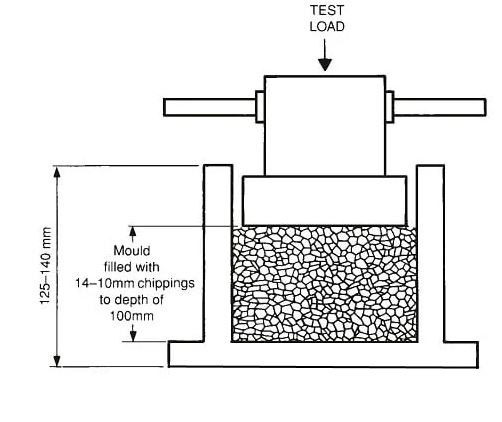

### INTRODUCTION 

Different rock samples give different compressive strength varying from minimum of about 45Mpa to maximum of 545Mpa. The compressive strength of parent rock does not exactly indicate the strength of aggregates in concrete. For this reason assessment of strength of the aggregates are made by using a sample bulk aggregates in standardized manner. The test conducted to know the compressive strength of aggregate is known as aggregates crushing value test. The crushing value of aggregates is rather insensitive to variation in strength of weaker aggregates. For this reason, a simple test known as 10 percent fine value is introduced. When the aggregates crushing value become 30% or higher, the results are likely to be inaccurate.

Aggregate Crushing Load 

(Source: IS 2386(Part 4):1963)
 

The aggregates crushing value provides a relative measure of resistance to crushing under a gradually applied compressive load. The principal mechanical property of aggregate required in any construction is (i) satisfactory resistance to crushing under the roller during construction (ii) adequate resistance to surface abrasion under traffic. Aggregates used in road construction should be strong enough to resist crushing under traffic wheel load. If aggregates are weak the stability of pavement structure is adversely affected. The strong aggregates will have low crushing value and weak aggregates have high crushing value. The aggregate crushing strength for various types of surface course of pavements should be high enough to withstand the high wheel load, including the steel tires of loaded bullock-carts. However, low strength aggregates having lesser crushing strength are used in base and sub-base courses of pavements. IRC have specified aggregates crushing values of the coarse aggregates used for cement concrete surface should not exceed 30%. For aggregates used for concrete other than surfaces, the aggregates crushing values should not exceed 45%.

Aggregate Crushing Value for different types of Roads / Pavements  

<table style="width:800px;margin-left: 0;text-align:center;font-size:100%">
<tr style="text-align:center">
<th style="text-align:center;height:50px;width:2%">Types of Roads / Pavements</th>
<th style="text-align:center;height:50px;width:1%">Aggregate Crushing Value Limit</th>
</tr>
<tr>
<th colspan="2" style="text-align:center;height:50px;">Flexible Pavements</th>
</tr>
<tr style="text-align:center;height:50px;">
<td>Soling</td>
<td> 50</td>
</tr>
<tr style="text-align:center;height:50px;">
<td>Water bound macadam</td>
<td>40</td>
</tr>
<tr style="text-align:center;height:50px;">
<td>Bituminous macadam</td>
<td>40</td>
</tr>
<tr style="text-align:center;height:50px;">
<td>Bituminous surface dressing or thin premix carpet</td>
<td>30</td>
</tr>
<tr style="text-align:center;height:50px;">
<td>Dense mix carpet</td>
<td>30</td>
</tr>
<tr>
<th colspan="2" style="text-align:center;height:50px;">Rigid Pavements</th>
</tr>
<tr style="text-align:center;height:50px;">
<td>Other than wearing course</td>
<td> 45</td>
</tr>
<tr style="text-align:center;height:50px;">
<td>Surface or Wearing course</td>
<td>30</td>
</tr>
</table>
 

 
(Source: IS 2386(Part 4):1963)
 

<strong>Relevant Indian Standard for Crushing Test on Aggregate</strong>:
  
<ol style="text-indent:25px; text-align:justify;list-style-position: inside">
<li>IS 2386 (Part IV) 1963: Methods of Test for Aggregates Mechanical Properties, Tenth Reprint MARCH 1997.</li>
<li>IS 383-1970: Specification for Coarse and Fine Aggregates.</li>
</ol>
